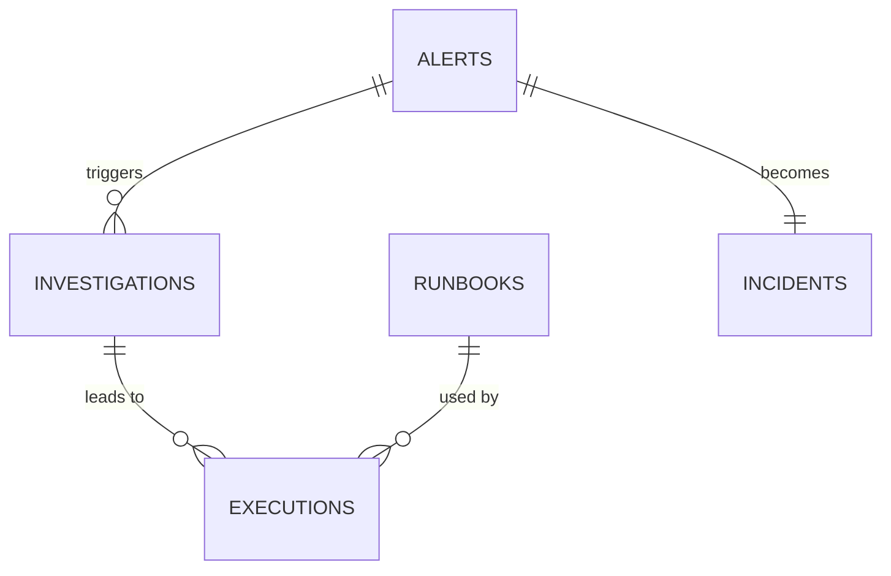
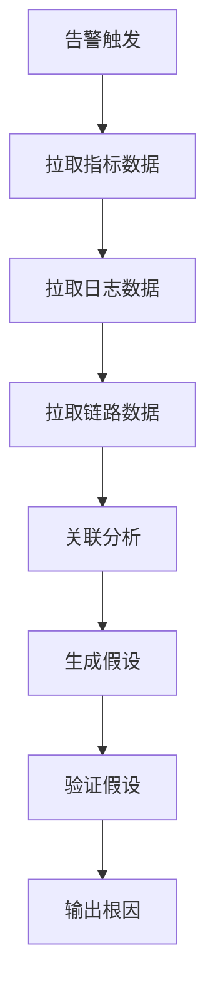

# 架构设计 - SRE 问题定位与解决 Agent

**创建日期**: 2026-03-14  
**创建人**: Architect Agent  
**状态**: approved  
**关联需求**: [REQUIREMENTS.md](./REQUIREMENTS.md)

---

## 1. 架构概述

### 1.1 设计原则
1. **可观察性优先**: 所有操作可追踪、可审计
2. **安全至上**: 所有修复操作需确认 + 可回滚
3. **渐进式自动化**: 从建议→确认执行→自动执行
4. **知识沉淀**: 每次解决都更新知识库

### 1.2 架构图
```
┌─────────────────────────────────────────────────────────────────┐
│                        用户界面层                                │
│  ┌─────────────┐  ┌─────────────┐  ┌─────────────┐             │
│  │  Chat/Slack │  │  Web Dashboard │  │  API      │             │
│  └─────────────┘  └─────────────┘  └─────────────┘             │
└─────────────────────────────────────────────────────────────────┘
                              │
                              ▼
┌─────────────────────────────────────────────────────────────────┐
│                      SRE Agent Core                             │
│  ┌─────────────┐  ┌─────────────┐  ┌─────────────┐             │
│  │ 告警接收器   │  │ 分析引擎     │  │ 执行引擎     │             │
│  │ Alert       │  │ Analysis    │  │ Execution   │             │
│  │ Receiver    │  │ Engine      │  │ Engine      │             │
│  └─────────────┘  └─────────────┘  └─────────────┘             │
│  ┌─────────────┐  ┌─────────────┐  ┌─────────────┐             │
│  │ 知识库      │  │ 决策引擎     │  │ 报告生成器   │             │
│  │ Knowledge   │  │ Decision    │  │ Reporter    │             │
│  │ Base        │  │ Engine      │  │             │             │
│  └─────────────┘  └─────────────┘  └─────────────┘             │
└─────────────────────────────────────────────────────────────────┘
                              │
              ┌───────────────┼───────────────┐
              │               │               │
              ▼               ▼               ▼
┌─────────────────┐ ┌─────────────────┐ ┌─────────────────┐
│   指标数据源     │ │   日志数据源     │ │   链路数据源     │
│  Prometheus     │ │   Loki/ELK     │ │   Jaeger/Tempo │
└─────────────────┘ └─────────────────┘ └─────────────────┘
              │               │               │
              └───────────────┼───────────────┘
                              │
                              ▼
┌─────────────────────────────────────────────────────────────────┐
│                      执行目标层                                 │
│  ┌─────────────┐  ┌─────────────┐  ┌─────────────┐             │
│  │ Kubernetes  │  │  云服务器     │  │  数据库      │             │
│  └─────────────┘  └─────────────┘  └─────────────┘             │
└─────────────────────────────────────────────────────────────────┘
```

### 1.3 核心组件
| 组件 | 职责 | 技术选型 |
|------|------|----------|
| 告警接收器 | 接收和解析告警 | Webhook + Message Queue |
| 分析引擎 | 多源数据关联分析 | Python + ML |
| 知识库 | 存储历史案例和解决方案 | Vector DB + Markdown |
| 决策引擎 | 选择最佳解决方案 | Rule Engine + LLM |
| 执行引擎 | 执行修复操作 | Kubernetes API + SSH |
| 报告生成器 | 生成事故报告 | Template Engine |

---

## 2. 数据设计

### 2.1 数据模型
```sql
-- 告警记录
CREATE TABLE alerts (
  id BIGSERIAL PRIMARY KEY,
  alert_name VARCHAR(200) NOT NULL,
  service_name VARCHAR(100) NOT NULL,
  severity VARCHAR(20) NOT NULL, -- critical/warning/info
  triggered_at TIMESTAMP NOT NULL,
  resolved_at TIMESTAMP,
  status VARCHAR(20) DEFAULT 'open', -- open/investigating/resolved
  metric_name VARCHAR(100),
  metric_value DECIMAL,
  threshold DECIMAL,
  labels JSONB, -- 额外标签
  created_at TIMESTAMP DEFAULT NOW()
);

-- 问题分析记录
CREATE TABLE investigations (
  id BIGSERIAL PRIMARY KEY,
  alert_id BIGINT REFERENCES alerts(id),
  root_cause TEXT,
  analysis_result JSONB, -- 分析结果
  related_logs TEXT[], -- 相关日志片段
  related_metrics JSONB, -- 相关指标
  created_at TIMESTAMP DEFAULT NOW()
);

-- 解决方案库
CREATE TABLE runbooks (
  id BIGSERIAL PRIMARY KEY,
  title VARCHAR(200) NOT NULL,
  alert_pattern VARCHAR(200), -- 匹配的告警模式
  steps JSONB NOT NULL, -- 执行步骤
  success_rate DECIMAL(5,2), -- 成功率
  risk_level VARCHAR(20), -- low/medium/high
  requires_approval BOOLEAN DEFAULT true,
  created_at TIMESTAMP DEFAULT NOW(),
  updated_at TIMESTAMP DEFAULT NOW()
);

-- 执行记录
CREATE TABLE executions (
  id BIGSERIAL PRIMARY KEY,
  investigation_id BIGINT REFERENCES investigations(id),
  runbook_id BIGINT REFERENCES runbooks(id),
  status VARCHAR(20) NOT NULL, -- pending/running/success/failed/rolled_back
  executed_by VARCHAR(100), -- user or 'auto'
  approved_by VARCHAR(100),
  started_at TIMESTAMP,
  completed_at TIMESTAMP,
  result JSONB,
  rollback_result JSONB,
  created_at TIMESTAMP DEFAULT NOW()
);

-- 事故报告
CREATE TABLE incidents (
  id BIGSERIAL PRIMARY KEY,
  alert_id BIGINT REFERENCES alerts(id),
  title VARCHAR(200) NOT NULL,
  summary TEXT,
  timeline JSONB, -- 时间线
  impact TEXT, -- 影响范围
  root_cause TEXT,
  lessons_learned TEXT[], -- 改进建议
  mttr_seconds INTEGER,
  created_at TIMESTAMP DEFAULT NOW()
);
```

### 2.2 ER 图


### 2.3 数据流
```
告警触发 → 告警接收器 → 分析引擎 → 查询知识库
                                    │
                                    ▼
                            推荐解决方案
                                    │
                                    ▼
                            决策引擎选择
                                    │
                                    ▼
                            执行引擎执行
                                    │
                                    ▼
                            验证结果 → 更新知识库
```

---

## 3. API 设计

### 3.1 API 概览
| 方法 | 路径 | 描述 | 认证 |
|------|------|------|------|
| POST | /api/v1/alerts | 接收告警 | Required |
| GET | /api/v1/alerts/{id}/analysis | 获取分析报告 | Required |
| GET | /api/v1/alerts/{id}/solutions | 获取推荐方案 | Required |
| POST | /api/v1/executions | 执行修复 | Required |
| GET | /api/v1/executions/{id} | 获取执行状态 | Required |
| POST | /api/v1/executions/{id}/rollback | 回滚操作 | Required |
| GET | /api/v1/incidents/{id}/report | 获取事故报告 | Required |

### 3.2 详细 API 定义

#### POST /api/v1/alerts
接收告警

**请求**:
```json
{
  "alert_name": "HighCPUUsage",
  "service_name": "payment-service",
  "severity": "critical",
  "metric_name": "cpu_usage",
  "metric_value": 95.5,
  "threshold": 80,
  "labels": {
    "instance": "prod-payment-01",
    "namespace": "production"
  }
}
```

**响应 (200)**:
```json
{
  "code": 0,
  "data": {
    "alert_id": "alert-123",
    "status": "investigating",
    "analysis_url": "/api/v1/alerts/alert-123/analysis"
  }
}
```

#### GET /api/v1/alerts/{id}/analysis
获取分析报告

**响应 (200)**:
```json
{
  "code": 0,
  "data": {
    "alert_id": "alert-123",
    "root_cause": "Pod 资源不足导致 CPU 飙升",
    "confidence": 0.85,
    "possible_causes": [
      {"cause": "流量突增", "probability": 0.6},
      {"cause": "代码性能问题", "probability": 0.3},
      {"cause": "资源配额不足", "probability": 0.1}
    ],
    "related_logs": [...],
    "related_metrics": {...}
  }
}
```

#### POST /api/v1/executions
执行修复

**请求**:
```json
{
  "alert_id": "alert-123",
  "runbook_id": "runbook-456",
  "approved_by": "user-789",
  "parameters": {
    "target_pod": "prod-payment-01",
    "new_cpu_limit": "2000m"
  }
}
```

**响应 (202)**:
```json
{
  "code": 0,
  "data": {
    "execution_id": "exec-789",
    "status": "running",
    "estimated_duration": "30s"
  }
}
```

---

## 4. 技术选型

### 4.1 技术栈
| 层级 | 技术 | 版本 | 理由 |
|------|------|------|------|
| 后端 | Python/FastAPI | 3.11+ | 快速开发、异步支持 |
| 前端 | React | 18.x | 成熟生态 |
| 数据库 | PostgreSQL | 15+ | JSONB 支持、可靠性 |
| 向量库 | Chroma/Pinecone | - | 知识库相似度搜索 |
| 缓存 | Redis | 7.x | 高性能 |
| 消息队列 | RabbitMQ | 3.x | 告警缓冲 |
| K8s 客户端 | Kubernetes Python Client | - | 原生支持 |

### 4.2 关键技术决策

#### 决策 1: 分析引擎实现
- **选项 A**: 纯规则引擎
- **选项 B**: ML 模型 + 规则
- **选择**: 规则 + LLM 混合
- **理由**: 规则保证确定性，LLM 处理模糊场景

#### 决策 2: 执行安全
- **选项 A**: 全自动执行
- **选项 B**: 所有操作需人工确认
- **选择**: 分级审批（低风险自动，高风险人工）
- **理由**: 平衡效率和安全性

---

## 5. 核心算法和流程

### 5.1 问题分析流程


### 5.2 解决方案匹配算法
```python
def match_runbook(alert, investigations_history):
    # 1. 基于告警模式匹配
    pattern_matches = find_by_alert_pattern(alert.name)
    
    # 2. 基于相似度搜索（向量）
    similar_cases = vector_search(alert.context, top_k=10)
    
    # 3. 合并排序
    candidates = merge_and_rank(pattern_matches, similar_cases)
    
    # 4. 过滤（风险等级、权限）
    filtered = filter_by_risk_and_permission(candidates)
    
    # 5. 返回 Top 3
    return filtered[:3]
```

---

## 6. 安全设计

### 6.1 认证机制
- OAuth2 + JWT
- 服务间通信用 mTLS

### 6.2 授权机制
- RBAC 角色：Viewer/Operator/Admin
- 高危操作需要 Admin 审批

### 6.3 数据安全
- 敏感配置用 Secret 管理
- 日志自动脱敏（IP、用户 ID）

### 6.4 审计日志
- 所有执行操作记录
- 包含操作人、时间、参数、结果

---

## 7. 性能设计

### 7.1 缓存策略
- 分析报告缓存 5 分钟
- Runbook 缓存 1 小时
- 指标数据缓存 1 分钟

### 7.2 数据库优化
- alerts 表按时间分区
- 常用查询字段建索引

### 7.3 异步处理
- 告警接收后异步分析
- 执行状态异步通知

---

## 8. 部署架构

### 8.1 环境规划
| 环境 | 用途 | 配置 |
|------|------|------|
| dev | 开发测试 | 1 副本，最小资源 |
| staging | 集成测试 | 2 副本，模拟生产 |
| prod | 线上服务 | 3 副本，HA 部署 |

### 8.2 扩缩容策略
- 基于 CPU/内存自动扩缩容
- 告警高峰期前预扩容

---

## 9. 监控和告警

### 9.1 关键指标
- 业务指标：MTTR、解决率、自动化率
- 技术指标：响应时间、错误率、可用性

### 9.2 告警阈值
| 指标 | 警告 | 严重 |
|------|------|------|
| 响应时间 P95 | >5s | >10s |
| 错误率 | >1% | >5% |
| 分析失败率 | >5% | >10% |

---

## 10. 测试策略

### 10.1 测试层次
- 单元测试：核心算法和工具函数
- 集成测试：数据源集成、K8s 集成
- E2E 测试：完整告警→分析→解决流程

### 10.2 测试重点
- 告警解析准确性
- 分析结果正确性
- 执行操作安全性
- 回滚机制可靠性

---

## 11. 待决策事项

| 事项 | 影响 | 截止时间 | 状态 |
|------|------|----------|------|
| 向量库选型 | 知识库搜索性能 | Week 2 | open |
| 审批流程设计 | 用户体验 | Week 1 | open |

---

**审批记录**:
- Architect: ✅ approved
- Dev: ⏳ pending review
- Test: ⏳ pending review
