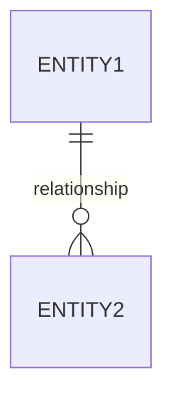
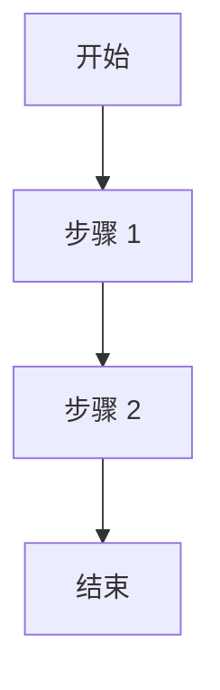

# 架构设计 - {项目名称}

**创建日期**: YYYY-MM-DD  
**创建人**: Architect Agent  
**状态**: draft/review/approved  
**关联需求**: [REQUIREMENTS.md](./REQUIREMENTS.md)

---

## 1. 架构概述

### 1.1 设计原则
*指导设计的核心原则*

### 1.2 架构图
```
[在此处绘制架构图或使用 mermaid]
```

### 1.3 核心组件
| 组件 | 职责 | 技术选型 |
|------|------|----------|
| | | |

---

## 2. 数据设计

### 2.1 数据模型
```sql
-- 在此处定义数据库表结构
CREATE TABLE example (
  id BIGSERIAL PRIMARY KEY,
  created_at TIMESTAMP DEFAULT NOW()
);
```

### 2.2 ER 图


### 2.3 数据流
*描述数据如何在系统中流动*

---

## 3. API 设计

### 3.1 API 概览
| 方法 | 路径 | 描述 | 认证 |
|------|------|------|------|
| GET | /api/v1/resource | 获取资源 | Required |

### 3.2 详细 API 定义

#### GET /api/v1/{resource}
**请求**:
```json
{}
```

**响应 (200)**:
```json
{}
```

**错误响应**:
| 状态码 | 描述 |
|--------|------|
| 400 | 请求参数错误 |
| 401 | 未授权 |
| 404 | 资源不存在 |

---

## 4. 技术选型

### 4.1 技术栈
| 层级 | 技术 | 版本 | 理由 |
|------|------|------|------|
| 前端 | | | |
| 后端 | | | |
| 数据库 | | | |
| 缓存 | | | |
| 消息队列 | | | |

### 4.2 关键技术决策

#### 决策 1: {决策内容}
- **选项 A**: 
- **选项 B**: 
- **选择**: 
- **理由**: 

---

## 5. 核心算法和流程

### 5.1 关键算法
*描述复杂算法的逻辑*

### 5.2 业务流程


---

## 6. 安全设计

### 6.1 认证机制
*如何验证用户身份*

### 6.2 授权机制
*如何控制访问权限*

### 6.3 数据安全
*数据加密、脱敏策略*

### 6.4 审计日志
*需要记录的关键操作*

---

## 7. 性能设计

### 7.1 缓存策略
*缓存什么、何时失效*

### 7.2 数据库优化
*索引、分库分表策略*

### 7.3 异步处理
*哪些操作可以异步*

---

## 8. 部署架构

### 8.1 环境规划
| 环境 | 用途 | 配置 |
|------|------|------|
| 开发 | 开发测试 | |
| 测试 | 集成测试 | |
| 生产 | 线上服务 | |

### 8.2 扩缩容策略
*如何根据负载扩展*

---

## 9. 监控和告警

### 9.1 关键指标
- 业务指标:
- 技术指标:

### 9.2 告警阈值
| 指标 | 警告 | 严重 |
|------|------|------|
| | | |

---

## 10. 测试策略

### 10.1 测试层次
- 单元测试:
- 集成测试:
- E2E 测试:

### 10.2 测试重点
*需要特别关注的测试场景*

---

## 11. 待决策事项

| 事项 | 影响 | 截止时间 | 状态 |
|------|------|----------|------|
| | | | open/resolved |

---

## 12. 附录

### 12.1 参考资料
- 

### 12.2 变更记录
| 日期 | 变更内容 | 变更人 |
|------|----------|--------|
| | | |

---

**审批记录**:
- Architect: [ ] approved
- Dev: [ ] reviewed
- Test: [ ] reviewed
